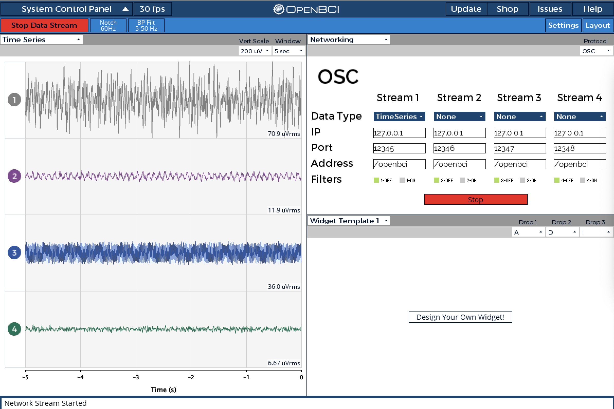

## osc_collect_data.py description:

This script helps you to collect your data with the OpenBCI GUI and turn it into .csv files, to do this the script outputs a label and waits 5 seconds for you to adjust to the position assigned to that label, then records 10 seconds of data at 200 Hz which is splitted into 40 sub samples

Setting up the OpenBCI GUI for streaming:

1) Open GUI and connect via bluetooth to OpenBCI Ganglion
2) Start system
3) Select networking widget with timeseries option and start system
4) Start data streaming

example:
<p align="center">
  
</p>

### osc_collect_data.py arguments:

Default values of these arguments are the default values for the OpenBCI GUI running in a local machine
  
* `--ip`
  * The ip to be listened, default = `localhost`
* `--port`
  * The port to be listened, default = `12345`
* `--address`
  * Address to be listened, default = `/openbci`

## osc_collect_data.py sample usage:
Making sure the osc_data directory has no unwanted data:
```
$ ls osc_data

```
Running osc_collect_data.py script:
```
$ python3 osc_collect_data.py
--------------------
 -- OSC LISTENER --
--------------------
IP: localhost
PORT: 12345
ADDRESS: /openbci
--------------------
##########################################
##########################################
    go
##########################################
##########################################
Produced go's csv no.: 40, sample: 40
##########################################
##########################################
    left
##########################################
##########################################
Produced left's csv no.: 40, sample: 80
##########################################
##########################################
    neutral
##########################################
##########################################
Produced neutral's csv no.: 40, sample: 120
##########################################
##########################################
    omega
##########################################
##########################################
Produced omega's csv no.: 40, sample: 160
##########################################
##########################################
    right
##########################################
##########################################
Produced right's csv no.: 40, sample: 200
##########################################
##########################################
    stop
##########################################
##########################################
Produced stop's csv no.: 40, sample: 240
##########################################
##########################################
    alpha
##########################################
##########################################
Produced alpha's csv no.: 40, sample: 280
```
Counting created files for each label(amount of files should match csv no.):
```
$ find osc_data -maxdepth 1 -mindepth 1 -type d -exec sh -c 'echo "{} : $(find "{}" -type f | wc -l)" file\(s\)' \;
osc_data/right :       40 file(s)
osc_data/go :       40 file(s)
osc_data/left :       40 file(s)
osc_data/stop :       40 file(s)
osc_data/neutral :       40 file(s)
osc_data/omega :       40 file(s)
osc_data/alpha :       40 file(s)
```
